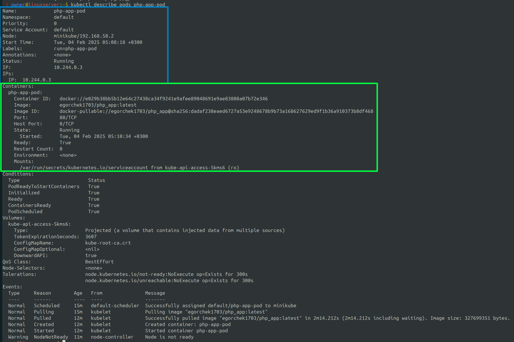
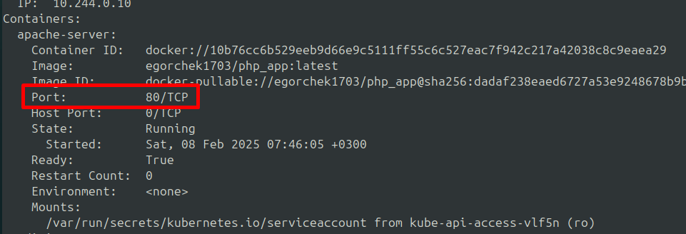
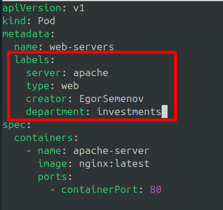

***Создание и управление PODS***  
  
Изначально необходимо поднять k8s кластер и проверить наличие хотя бы одной ноды:
```
    minikube start
```  
По аналогии с проверкой кол-ва поднятых нод, есть команда для проверки кол-ва поднятых pod-ов:
```
    kubectl get pods
```  
  
Для того чтобы создать новый pod необходимо выполнить команду:
```
    kubectl run <название_pod-a> --image=<название_image> --port=80

    kubectl run php-app-pod --image=egorchek1703/php_app:latest --port=80
```  
*Важно отметить, что слова в названии pod-ов должны разделяться символом тире "-", а не нижнем подчеркиванием "_". Символ подчеркивания недопустим.*  
В данный pod автоматически будет загружен указанный docker-образ, на его основании запущен docker-контейнер и открыт порт на котором работает контейнер.  
  
Для того чтобы удалить pod необходимо выполнить команду:
```
    kubectl delete pods <название_pod-a>
```  
  
Существует универсальная команда позволяющее получить описание какого-либо объекта кластера k8s:
```
    kubectl describe <объект> <название-объекта>

    kubectl describe pods php-app-pod
```  
Вывод данной команды представлен на скриншоте ниже:  
  
Между серверами кластера образуется своя сеть, поэтому данная команда очень важна, ведь она выводит подкапотный ip-адрес  
  
*Pod - это не виртуальная машина и не контейнер, а просто оболочка над контейнером(ами), которая обращается к ядру хоста на котором развернут кластер. Поэтому мы можем выполнять определенный команды "внутри" pod-а.*  
Для того чтобы выполнить команду внутри pod-а необходимо выполнить:
```
    kubectl exec [параметры] <название_pod-a> -- <команда>

    kubectl exec -it php-app-pod -- bash 
```  
  
Мы также можем просмотреть лог-файл имеющегося pod-а с помощью команды:
```
    kubectl logs <название_pod-a>
```  
  
Для сопряжение портов имеющихся pod-ов и локальных портов нашего хоста, существует специальная команда:  
```
    kubectl port-forward <название_pod-a> <порт_хоста>:<порт_pod-а>

    kubectl port-forward php-app-pod 7777:80
```  
*Теперь для того чтобы обратиться к веб-серверу, развернутому с помощью нашего контейнера, достаточно вбить в поисковую строку ip-адрес локального хоста и указать порт 7777, который в свою очередь будет перенаправлен на 80-ый порт контейнера*  
  
Чаще всего pod-ы создаются при помощи так называемых манифест-файлов. Это специльный yaml-файл в котором указываются конфигурационные параметры для создания pod-а и контейнеров внутри него. Минимальный синтаксис для создания pod-а через манифест-файл представлен ниже:
```
apiVersion: v1
kind: Pod
metadata:
  name: web-server
spec:
  containers:
    - name: apache-server
      image: egorchek1703/php_app:latest
```  
Для того чтобы создать pod с помощью имеющегося файла необходимо выполнить команду:
```
    kubectl apply -f <название_файла>

    kubectl apply -f pod_creating.yml
```  
  
Также для pod-ов, которым необходимо передача данных через сеть нужно не забыть открыть порт. Это делается с помощью указания в манифест-файле следующих строк:
```
...
spec:
  containers:
    - name: apache-server
      image: egorchek1703/php_app:latest
      ports:
        - containerPort: 80
```  
  
*В случае если мы изменили манифест-файл, то повторный его вызов не приведет к изменению существующего pod-а. Чтобы изменения вступили в силу необходимо удалить, а затем занового создать данный pod.*  
Теперь при выводе описания вновь созданного pod-а видно, что порт открыт:  
  
  
В данном случае, также как и в предыдущем, необходимо связать порты с помощью **port-forward**:
```
    kubectl port-forward web-servers 7777:80
```  
  
*Единственное что можно менять в манифест-файле и не делать **delete** запущенного pod-а, при этом отображая актуальные изменения - это docker-образ, т.е. поле **image**. После изменений важно выполнить **apply** и пробросить порты с помощью **port-forward**.*  
  
Важным элементом pod-а являются **labels**. Их также необходимо прописывать при создании манифест-файла. Labels - это массив и он является частью metadata:  
  
  
Помимо этого, с помощью манифест файлов мы можем создавать pod-ы с несколькими контейнерами внутри
```                                  two_pods_creating.yml                                              
apiVersion: v1
kind: Pod
metadata:
  name: two-web-servers
  labels:
    type: web
    creator: Egor_Semenov
    department: processing
spec:
  containers:
    - name: my-apache-server
      image: egorchek1703/php_app:latest
      ports:
        - containerPort: 80
    - name: tomcat-server
      image: tomcat:8.5.38
      ports:
        - containerPort: 8080
```
  
Для каждого из контейнеров, на данном этапе обучения, придется пробрасывать порты вручную с помощью **port-forward**, в случае, если мы хотим выполнить простые запросы к приложениям. Обычно общение с pod-ами осуществляется через службы о которых речь пойдет позже. При таком подходе ручное проброс каждого порта отдельно не понадобится.  
