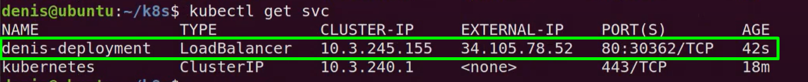
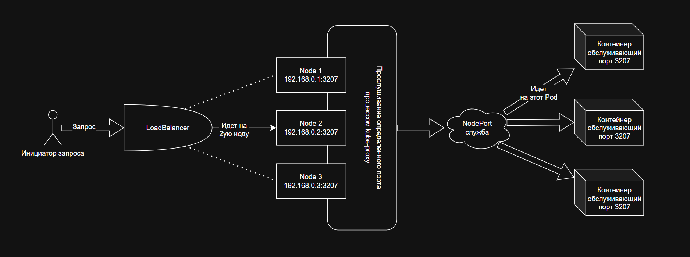
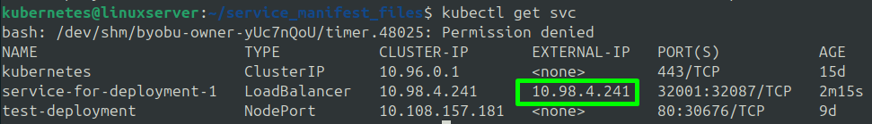

***Создание и управление Services***  
  
На данный момент существует 4 вида services (служб) по типу доступа к приложению развернутому в кластере k8s:  
1.  ClusterIP - доступ по IP-адресу внутри k8s кластера (тип доступа по умолчанию)  
2.  NodePort - доступ по определенному порту на **всех** worker-нодах внутри кластера (даже если есть пустые ноды без pod-ов, то на них также будет доступ к pod-у на другой ноде, через конкретный порт)  
3.  ExternalName - доступ через DNS CNAME Record  
4.  LoadBalancer - доступ через автоматически созданый балансировщик (работает только в облачных сервисах)  
  
Т.к. службы общаются с deployment, то изначально необходимо создать собственно сам deployment:
```
  kubectl create deployment web-app-dep --image=egorchek1703/php_app:latest
```
  
Теперь выполним ручной scaling для данного deployment:
```
  kubectl scale deployment/web-app-dep --replicas=2
```
  
Для того чтобы создать службу необходимо использовать команду **expose** (подвергнуть действию):
```
  kubectl expose deployment web-app-dep --type=ClusterIP --port=80
```
где поле **type** как раз-таки определяет тип доступа к pod-ам кластера, а поле port определяет тот порт на котором работают экземпляры нашего приложения
  
Что посмотреть имеющиеся службы необходимо выполнить
```
  kubectl get services
```  
или
```
  kubectl get svc
```  
  
Для удаления используется стандартная команда **delete**
```
  kubectl delete service <название-службы>
  kubectl delete service web-app-dep
```  
  
1. Создадим службу с типом ClusterIP  
```
  kubectl expose deployment test-deployment --type=ClusterIP --port=80
```  
  
Служба с типом ClusterIP, функционирует только внутри виртуальной сети кластера и достучаться до неё извне не получится, поэтому, зачастую, для внешних клиентских запросов не используют тип ClusterIP. Однако мы можем выполнить запрос к pod-у через данную службу, просто выполнив команду "изнутри" самого pod-а
```
  kubectl exec -it <название-pod-а> -- bash
  curl <ip_службы_с_типом_ClusterIP>
```  
  
2. Создадим службы с типом NodePort (тесно связана с типом LoadBalancer)
```
  kubectl expose deployment test-deployment --type=NodePort --port=80
```  
  
В контексте данного типа доступа мы работаем с таким процессом как kube-proxy. Это своего рода маршрутизатор, который на каждой ноде слушает запросы, и когда запрос приходит на определенный порт, он перенаправляет данный запрос на те pod-ы, которые обслуживают данный порт. Информация о том какие pod-ы обслуживают определенный порт (т.е. таблица соответствия) заполняется в момент создания службы с типом NodePort и динамически изменяется в зависимости от состояния кластера.
1. Служба с типом доступа NodePort открывает на **каждой** worker-ноде конкретный порт (например, 32777)
2. Запрос приходит на любую имеющуюся worker-ноду
3. Процесс kube-proxy, работающий на каждой worker-ноде, автоматически перенаправляет запрос, через кластерный ip, на ту ноду, на которой есть pod-ы, обслуживающие указанный в запросе порт (для маршрутизации запросов kube-proxy испольует что-то типа внутренней таблицы соответствия портов и pod-ов (которая динамически обновляется в зависимости от состояния кластера), которые обслуживают конкретный порт). Помимо маршрутизации kube-proxy выполняет также функцию балансировки трафика между pod-ами в рамках одной ноды. 
  
*Даже если мы напрямую будем обращатсья к ноде по её InternalIP, например, 192.168.0.2 и добавим тот самый порт, который обслуживается определенными pod-ами, то мы получим желаемый результат.*  
  
Если подвести итог, то служба с типом NodePort, просто создает внутренний процесс балансировки и предоставляет доступ к нодам и развернутым на них pod-ам, но не связывает их никаким образом с внешними запросами. Т.е. не предоставляет единый внешний IP-адрес, по которому мы сможем достучаться до нашей службы, а она, в свою очередь, уже с помощью процесса kube-proxy, будет маршрутизировать и балансировать внутри кластера запросы. Данная служба как будто задает правило, что если мы обратились к конкретной ноде, по определенному порту, то под капотом кластера, данный запрос необходимо перекинуть на pod, который "привязан" к данному порту.
Для связывания нашей службы с типом NodePort (балансировщика и маршрутизатора запросов внутри кластера) и внешнего ip-адреса, дополнительно используют специлальный LoadBalancer предоставляемый облачными сервисами (его задача просто балансировать трафик между нодами). Служба с типом LoadBalancer также под капотом создает службу с типом NodePort, но при этом предполагает создание процесса LoadBalancer, который в свою очередь умеет обращаться к службе с типом NodePort внутри кластера и присваивает ей внешний IP (т.е. свой собственный). ***Таким образом, LoadBalancer балансирует трафик между физическими нодами, на которых развернут кластер. Служба с типом NodePort задает правило, по которому процесс kube-proxy смотрит на порт, указанный в запросе и перенаправляет запрос, на конкретные pod-ы, используя общение внутри виртуальной сети кластера***  
  
Получается, что в данный момент служба NodePort выполняет лишь функции балансировки и перенаправления запросов с IP-адреса физических нод на IP-адреса pod-ов внутри кластера с помощью процесса kube-proxy. Для того чтобы не обращаться к конкретной ноде, а обращаться по одному общему IP-адресу, как раз-таки и необходимо создать службу с типом LoadBalancer. В таком случае параллельно службе NodePort, будет создан балансировщик LoadBalancer, который предоставит нашей службе внешний ip (на самом деле не службе, а нашим нодам общий ip). Обращаясь по данному внешнему IP, мы будем отправлять запрос на балансировщик, который в свою очередь будет перенаправлять запрос на worker-ноды, которые в свою очередь, будут слушать порт и с помощью kube-proxy, запрос будет перенаправляться далее внутрь виртуальной сети кластера, в те pod-ы, которые обслуживают конкретный порт (полученные из запроса) и объявленный для kube-proxy с помощью службы.
  
Для создания службы с типом LoadBalancer, необходимо чтобы облачный сервис предоставлял данный функционал и если это условие выполняет, то остается выполнить команду:  
```
  kubectl expose deployment test-deployment --type=LoadBalancer --port=80
```
  
Результатом выполнения данной команды будет следующая служба:  
  

Где:  
1. ExternalIP - внешний IP балансировщика трафика между физическими нодами  
2. InternalIP - IP службы внутри кластера  
3. Порты указаны в порядке <порт_службы_куда_перенаправлять_запрос>:<порт_ноды_откуда_придет_запрос>/<протокол>  
  
Схема маршрутизации запроса:  
  
  
Теперь научимся писать манифест-файлы для создания служб
  
Для создания deployment и службы одноврменно обслуживающей pod-ы данного deployment, чаще всего, для удобства используют общий манифест-файл:
```
apiVersion: apps/v1
kind: Deployment
metadata:
  name: deployment-1
  labels:
    env: app
    creator: Egor_Semenov
spec:
  replicas: 2
  selector:
    matchLabels:
      project: investments

  template:
    metadata:
      labels:
        project: investments
    spec:
      containers:
        - name: my-pod
          image: egorchek1703/php_app:latest
          ports:
            - containerPort: 80
---
apiVersion: v1
kind: Service
metadata:
  name: service-for-deployment-1
  labels:
    env: app
    creator: Egor_Semenov
    project: investments

spec:
  selector:
    project: investments # указываем labels pod-ов, с которыми будет связана данная служба
  ports:
    - name: investment-project-listener
      protocol: TCP
      port: 32001 # порт на LoadBalancer (на нодах)
      targetPort: 80 # порт pod-а на котором работает контейнер
  type: LoadBalancer
```  
  
Т.к. у нас нет возможности оплатить LoadBalancer на облачном сервисе в рамках обучения, на данном этапе, мы не сможем, использовать балансировку между node-ами. В этом можно убедиться, выполнив команду:
```
  kubectl get svc
```
  
Поле **EXTERNAL-IP** будет в статусе **pending**. Чтобы эмулировать работу балансировщика в minikube существует определенный функционал. Для его реализации необходимо в новом окне терминала выполнить команду:
```
  minikube tunnel
```
  
После чего необходимо ввести пароль пользователя под которым была выполнена данная команда и вернуться в предыдущее окно терминала. Теперь при выводе списка служб, созданная с помощью нашего манифест-файла служба получит EXTERNAL-IP:  
  
  
  
Соответственно теперь, обращась по данному внешнему IP и подставив к нему порт, который слушает наш kube-proxy на всех нодах, мы можем достучаться "извне" к контейнерам развернутым внутри наших pod-ов в рамках кластера. Помимо этого, при регулярном обновлении страницы с запросом в браузере, мы также сможем увидеть, что отрабатывает балансировка и трафик ходит на различные ноды, благодаря балансировке между нодами (с помощью **minikube tunnel**), а также ходит на различные pod-ы, благодаря балансировке реализуемой kube-proxy   