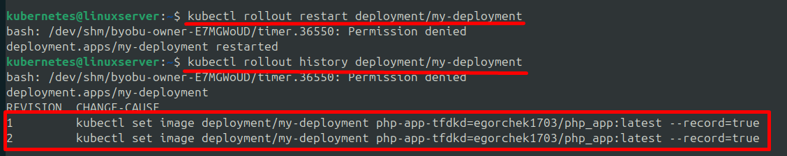

***Создание и управление Deployments***  
  
Для того чтобы проверить наличие каких-либо deployment необходимо выполнить команду
```
    kubectl get deployments
```
или
```
    kubectl get deploy
```
  
Обычно все pod-ы создаются в контексте какого-то определенного deployment, поэтому при создании deployment, мы можем указать image, который будет использоваться в внутреннем pod-e. Создания deployment-а происходит с помощью команды:
```
    kubectl create deployment <название-deployment> --image=<название_image>
    kubectl create deployment my-deployment --image=egorchek1703/php_app:latest
```
**Важно заметить, что при создании deployment, его название также не должно содержать символ нижнего подчеркивания "_"**  
Контейнер, созданный автоматически под капотом, будет назван также, как называется образ с DockerHub репозитория, на основании которого развертывается приложение. К названию образа могут быть дописаны некоторые символы и заменены символы нижнего подчеркивания на обычное тире.  
  
Для того чтобы отобразить информацию о deployment-е необходимо выполнить **describe**:  
```
    kubectl describe deployments <название-deployment>
    kubectl describe deployments my-deployment
```  
  
Для того чтобы увеличить количество реплик одного определенного deployment-а необходимо выполнить команду:
```
    kubectl scale deployment <название-deployment> --replicas=<количество_реплик>
    kubectl scale deployment my-deployment --replicas=4
```  
  
Благодаря выполнению данной команды мы указываем deployment-у, что целевое кол-во одновременно активных pod-ов данного deployment-а должно равняться 4. При этом существующий объект ReplicaSet управляет данным deployment и автоматически регулирует количество запущенных pod-ов, чтобы их всегда оставалось 4. Чтобы отобразить имеющиеся объекты ReplicaSet необходимо выполнить:
```
    kubectl get rs
```
  
В данном случае мы вручную "захардкодили" кол-во активных pod-ов. ReplicaSet будет стараться поддерживать данное значение при любых условиях. Также мы можем настроить autoscaling - автоматическое увеличиние кол-ва pod-ов в зависимости от нагрузки на систему. Команда:
```
    kubectl autoscale deployment my-deployment --min=4 --max=6 --cpu-percent=80
```  
где  
1. --min=4 - задает минимальное кол-во pod-ов  
2. --max=6 - задает максимальное кол-во pod-ов  
3. --cpu-percent - задает процент нагрузки на процессор суммарно всеми активными pod-ами (если процент будет расти, то Kubernetes будет увеличивать кол-во pod-ов постепенно до максимального значения)  
  
После выполнения данной команды создается дополнительный объект "Horizontal Pods Autoscaler" (hpa). Данный объект по своей сути похож на ReplicaSet, но отличается тем, что его основной задачей является увеличение числа pod-ов в зависимости от нагрузки на CPU. Для того чтобы отобразить имеющиеся объекты hpa необходимо выполнить:
```
    kubectl get hpa
```  
  
В случаях, когда наш софт был модернизирован и мы запушили обновленный образ в Docker Hub, нам может понадобиться выполнить внедрение изменений в наш deployment. Kubernetes позволяет сделать это бесшовно. Сначала запускаются реплики (pod-ы) с новым образом, а затем когда они будут подняты, выключаются реплики с старым образом.  
Для наглядности примера поменяем image для нашего deployment
```
    kubectl set image deployment/<название-deployment> <имя_текущего_контейнера>=<имя_обновленного_образа> --record
    kubectl set image deployment/my-deployment php-app-tfdkd=egorchek1703/php_app:latest --record
```  
Для того чтобы узнать имя текущего контейнера, достаточно выполнить **describe** любому pod-у внутри нашего deployment.  
Параметр **--record** задает необходимость записи данного изменения образа в истории.  
  
Чтобы отобразить историю обновлений нашего образа внутри deployment, нам необходимо выполнить команду **rollout history** (история развёртывания):
```
    kubectl rollout history deployment/<название-deployment>
    kubectl rollout history deployment/my-deployment
```
  
Также мы можем проверить текущий статус развертывания с помощью:
```
    kubectl rollout status deployment/<название-deployment>
    kubectl rollout status deployment/my-deployment
```  
  
При развертывании обновленного приложения могут возникнуть какие-либо баги, поэтому важно помнить команду для оперативного переключения на предыдущую версию образа:
```
    kubectl rollout undo deployment/<название-deployment>
```  
или для возврата на конкретную версию:
```
    kubectl rollout undo deployment/<название-deployment> --to-revision=<номер_версии>
```
*Номер версии на которую мы хотим вернуться можно посмотреть с помощью команды **rollout history**.*  
  
Если мы поменяли образ с тегом latest, т.е. обновили его, и локально у нас pod-ы хранят контейнеры на основании этого образа (также latest, но уже устаревшего), то при попытке загрузить latest повторно ничего не произойдет, т.к. Kubernetes видит, что у нас уже развернуты контейнеры на основе последнего образа и думает, что он актуальный. Чтобы сделать принудительное стягивание образа, даже несмотря на то, что его локальная версия не совпадает с удаленной, необходимо выполнить команду:
```
    kubectl rollout restart deployment/<название-deployment>
    kubectl rollout restart deployment/my-deployment
```  
  
Вот такой результат мы получим:  
  
  
Аналогично с созданием pod-ов, зачастую никто не создает deployment-ы с помощью ручных команд. Чаще используют манифест-файлы. Соответственно, их нужно уметь писать. Стандартный манифест-файл для создания deployment выглядит следующим образом:  
```
apiVersion: apps/v1
kind: Deployment
metadata:
  name: cool-deployment
  labels:
    creator: Egor_Semenov
    department: investments
    type: web
spec:
  selector:
    matchLabels:
      project: investment_terminal
  template:
    metadata:
      labels:
        creator: Egor_Semenov
        project: investment_terminal
    spec:
      containers:
        - name: investment-terminal
          image: egorchek1703/php_app:latest
          ports:
            - containerPort: 80
```  
  
*Раздел selector, с помощью вложенного блока matchLabels, указывает на то, что данный deployment будет управлять pod-ами имеющими label "project" равный "investment_terminal". Раздел template описывает шаблон для создаваемых pod-ов внутри deployment.*  
  
Для того чтобы создать с помощью манифест-файла, помимо deployment-а, ещё и ReplicaSet-объект с определением кол-ва реплик, необходимо указать строку "replicas: 3" отдним из подразделов в **spec**, т.е.:
```
apiVersion: apps/v1
kind: Deployment
metadata:
  name: cool-deployment
  labels:
    creator: Egor_Semenov
    department: investments
    type: web
spec:
  replicas: 3
  selector:
    matchLabels:
      project: investment_terminal
  template:
    metadata:
      labels:
        creator: Egor_Semenov
        project: investment_terminal
    spec:
      containers:
        - name: investment-terminal
          image: egorchek1703/php_app:latest
          ports:
            - containerPort: 80
```  
  
*Важно отметить, что в манифест-файле также необходимо указывать название pod-ов и самого deployment без символа нижнего подчеркивание "_".*
  
Также как и для запуска манифест-файла для создания pod-ов, при создании deployment необходимо выполнить команду **apply**  
```
  kubectl apply -f <название_манифест_файла>
  kubectl apply -f deployment_creating.yml
```  
  
В данном случае мы создали deployment и с помощью поля **spec.replicas** "захардкодили" количество реплик данного deployment (При этом Deployment автоматически создал объект ReplicaSet, выполняющий задачу поддержания кол-ва реплик на уровне того значения, которое мы указали в **spec.replicas**)
  
*Важно также отметить, что при pod-ы создаваемые с помощью **template** внутри deployment могут иметь  больше labels, чем сам deployment (в spec.selector.matchLabels)*  
  
Ранее мы создали с помощью манифест-файла обычный deployment без указания количества реплик, а также deployment с объектом ReplicaSet, который жестко устанавливал кол-во реплик deployment, которые должны быть запущены в кластере. Для того чтобы сделать autoscaling необходимо либо в том же манифест-файле в котором создаем deployment, либо в другом пустом манифест-файле создать объект HorizontalPodsAutoscaler (hpa). Синтаксис создания данного объекта следующий:
```
apiVersion: autoscaling/v2
kind: HorizontalPodAutoscaler
metadata:
  name: invest-web-app-hpa

spec:
  scaleTargetRef:
    apiVersion: apps/v1
    kind: Deployment
    name: deployment_with_autoscaling

  minReplicas: 2
  maxReplicas: 4

  metrics:
  - type: Resource
    resource:
      name: cpu
      target:
        type: Utilization
        averageUtilization: 60

  - type: Resource
    resource:
      name: memory
      target:
        type: Utilization
        averageUtilization: 60
```  
  
*Если мы создаем данный обект в том же yaml-файле, что и сам deployment, то следует разделить данный манифест-файл на документы с помощью символов "---"*
  
Поэтапно разберем каждый участок кода:  
1. Создаем HPA-объект
```
apiVersion: autoscaling/v2
kind: HorizontalPodAutoscaler
metadata:
  name: invest-web-app-hpa

spec:
  ...
```  
  
2. Указываем каким deployment данный объект должен управлять:  
```
  scaleTargetRef:
    apiVersion: apps/v1
    kind: Deployment
    name: deployment_with_autoscaling
```
В данном случае, deployment-ом "deployment_with_autoscaling"  
  
3. Обозначаем минимальное и максимальное кол-во реплик:
```
  minReplicas: 2
  maxReplicas: 4
```  
  
4. Задаем перечень метрик, которые необходимо отслеживать и в случае их изменения, запускать/отключать дополнительные реплики deployment:
```
metrics:
  - type: Resource
    resource:
      name: cpu
      target:
        type: Utilization
        averageUtilization: 60

  - type: Resource
    resource:
      name: memory
      target:
        type: Utilization
        averageUtilization: 60
```
  
На данном этапе мы задаем массиву metrics два ресурса: CPU (нагрузка процессора) и Memory (оперативная память).  
Декодирование блоков описания метрик:  
1.  
  **- type: Resource**  
Означает, что типом метрики является ресурс контейнера  
2.  
  **resource:**  
    **name: cpu**  
Указываем конкретный ресурс, который будет мониториться  
3.  
  **target:**  
    **type: Utilization**  
    **averageUtilization: 60**  
Теперь описываем сущность цели, достижение которой приведет к изменению кол-ва реплик. В данном случае цель имеет тип утилизации, т.е. использвоание ресурса и значение не должно превышать 60% суммарно по всем pod-ам внутри deployment. Каждой реплике deployment "под капотом" выделяется определенное кол-во процессоров, например, 2 и как только среднее значение использования ресурса между всеми репликами превысит указанный target, то будет запущена еще одна реплика.  
Т.е. если есть 2 реплики, каждая из которых имеет 2 процессора и на каждой используется всего 1 процессор, то средняя нагрузка 50%:  
1. 1/2 = 50%  
2. 1/2 = 50%  
В случае если на одной реплике будет задействован второй процессор, то среднее значение имзениться:  
1. 2/2 = 100%  
2. 1/2 = 50%  
Следовательно, среднее значение 75%, а значит будет поднята 3 реплика deployment  
  
Для того чтобы "убить" все объекты кластера, созданные на основании манифест-файла, достаточно выполнить команду:
```
  kubectl delete -f <название_файла.yml>
  kubectl delete -f creating_deployment_with_autoscale.yml
```  
  
Для того чтобы применить удаление ко всем объектам определенного типа, необходимо выполнить команду:
```
  kubectl delete deployment --all
```