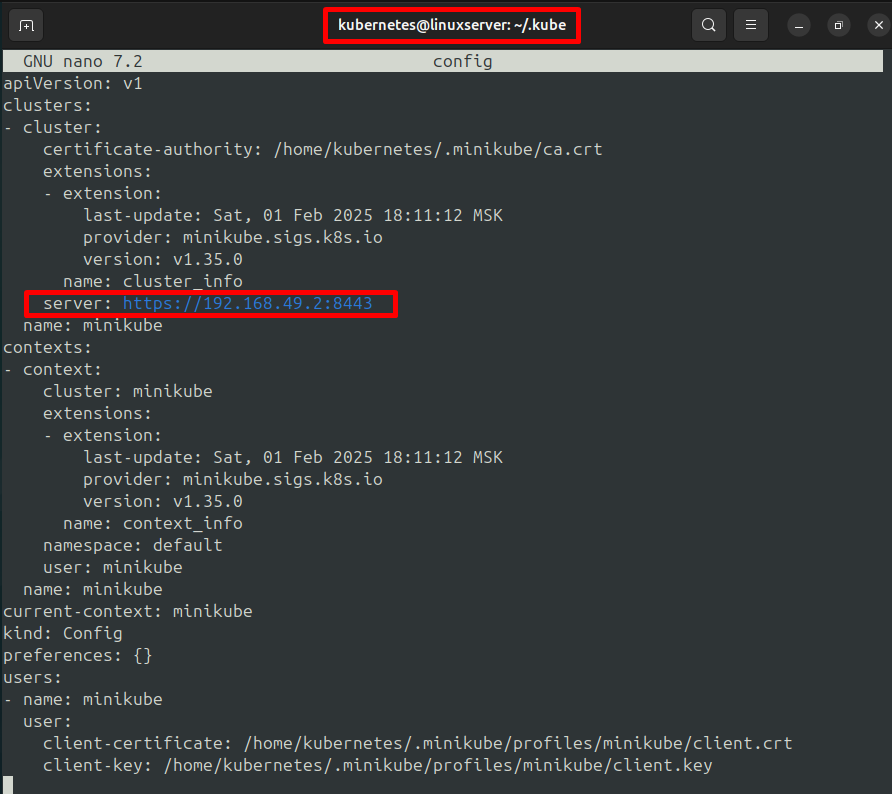
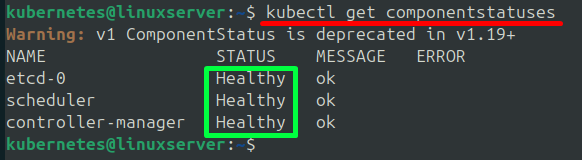

***Установка и запуск кластера***  
  
Чтобы установить кластер нам необходимо установить утилиту **kubectl** ([инструкция](https://kubernetes.io/docs/tasks/tools/install-kubectl-linux/)) и для целей обучения специальный файл **minikube** ([инструкция](https://kubernetes.io/docs/tutorials/hello-minikube/))  
  
kubectl — это командная утилита, которая позволяет взаимодействовать с Kubernetes-кластером. С помощью kubectl мы можем создавать, обновлять, удалять и управлять ресурсами в кластере, а также выполнять другие операции.  
  
minikube — это инструмент для запуска локального Kubernetes-кластера на одной машине. Он позволяет быстро разворачивать кластер для разработки и тестирования. Minikube запускает кластер в виртуальной машине (VM) или через контейнеры в зависимости от конфигурации.  
  
Для запуска кластера с помощью minikube в системе необходимо как минимум свободных 2 CPUs, 2 GB оперативной памяти и 20 GB дискового пространства.  
  
В промышленном масштабе не используются кластеры, сформированные с помощью виртуализации. Т.е. кластер разворачивается прямиком на хосте. Для таких целей используется инструмент (утилита) под названием **Kubeadm**.  
  
В данном курсе мы будем работать с кластером, инициализированным с помощью minikube, для увеличение скорости изучения базового функционала k8s. Чтобы запустить кластер с помощью minikube необходимо выполнить команду:
```
    minikube start
```  
Данная команда автоматически создает виртуальную машину для кластера с помощью VirtualBox, что не совсем логично, т.к. мы запускаем кластер уже на виртуальной машине. В таком случае, логичным будет использовать в качестве инструмента виртуализации docker. Поэтому при инициализации и запуске кластера следует переназначить драйвер для виртуализации по умолчанию на docker:
```
    minikube start --driver=docker
```  
После этого инициализируется и запускается кластер k8s. Развернуть кластер под root не получится. *Поэтому хорошей практикой будет создание отдельного пользователя, например, kubernetes для развертывания кластера.*  
Соответственно, если мы выполниим команду **minikube start --driver=docker** под пользователем kubernetes, то кластер и его системные/конфигурационные файлы будут созданы в домашней директории пользователя kubernetes. Это довольно удобно. *Важно добавить пользователя kubernetes в группу docker, в случае использования docker, в качестве инструмента виртуализации.* Это можно сделать с помощью команды:
```
    sudo usermod -aG docker kubernetes
```
  
Главный конфигурационный файл обычно лежит по пути "**/home/kubernetes/.kube/config**". Выглядит данный файл следующим образом:  
  
  
В данном файле есть ряд важный параметров, например ip-адрес по которому у нас развернут кластер.  
  
Теперь, после того как мы запустили кластер можно проверить его работоспособность с помощью нескольких базовых команд утилиты **kubectl**:
```
    kubectl get componentstatuses
```  
Данная команда выводит статус компонентов кластера  
  
  
Также важной базовой командой данной утилиты является:
```
    kubectl cluster-info
```  
Она отображает ip-адрес кластера и внутренней DNS-службы.  
  
Помимо этого, существует специальная команда для отображения нод (или хостов), включенных в кластер:
```
    kubectl get nodes
```  
  
Для того чтобы остановить кластер необходимо использовать команду:
```
    minikube stop
```  
Для того чтобы удалить кластер, необходимо выполнить 
```
    minikube delete
```  
  
При очередном запуске кластера у нас есть возможность изменить кол-во системных ресурсов, выделенных под него с помощью:
```
    minikube start --cpus=4 --memory=8gb --disk-size=40gb
```  
**Важно:** *Эти параметры применяются только при запуске нового кластера или перезапуске существующего. Поменять системные ресурсы у запущенного кластера не получится*  
  
После развертывания кластера мы также можем "провалиться" в контейнер в котором развернут кластер, предварительно узнав название docker-контейнера, с помощью команд:
```
    docker ps
    docker exec -it minikube bash
```  
  
Внутри данного контейнера уже установлены некоторые docker-images, для работы кластера. Для их отображения можно вывести:
```
    docker images
```  
  
Также залогинитсья внутрь контейнера с развернутым кластером k8s можно с помощью специальной команды:
```
    minikube ssh
```
*В данном случае мы войдем в контейнер под пользователем docker, а не root, как в предыдущем примере.*  
  
Внутри docker-контейнера с кластером существует два пользователя: root и docker. Пароль пользователя docker - **tcuser**. Пароль у пользователя root отсутствует.  
  
Помимо подхода описанного выше, кластер k8s часто поднимают на серверах Amazon в AWS с помощью утилиты **eksctl** и на серверах Google в GCP с помощью **Google Cloud SDK**. В обоих случаях для управления кластером понадобится также утилита **kubectl**